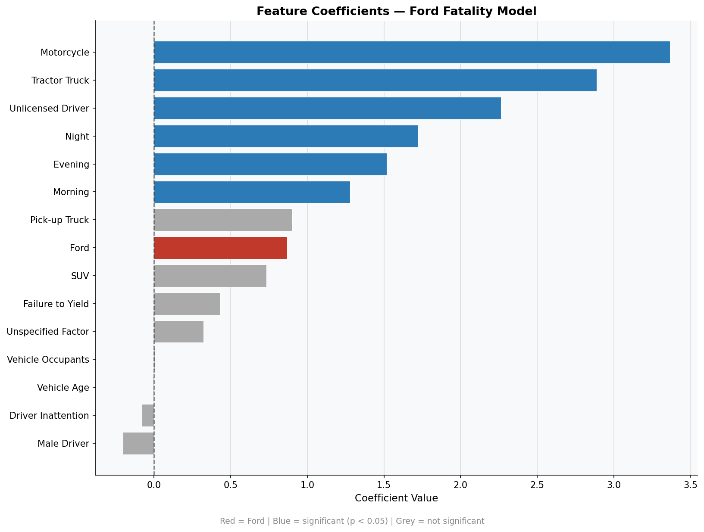
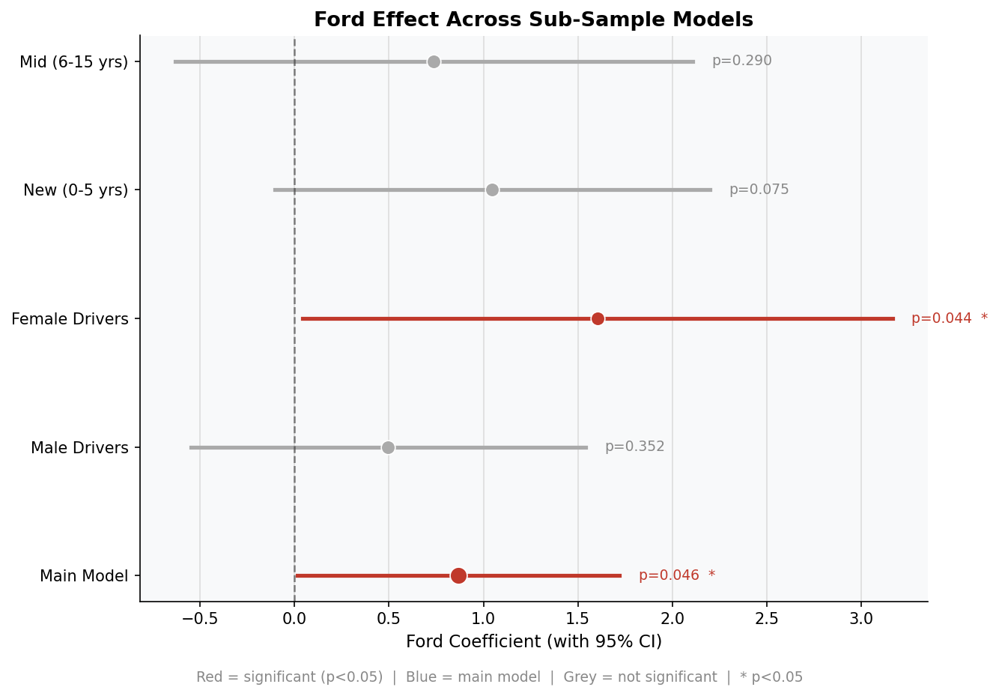
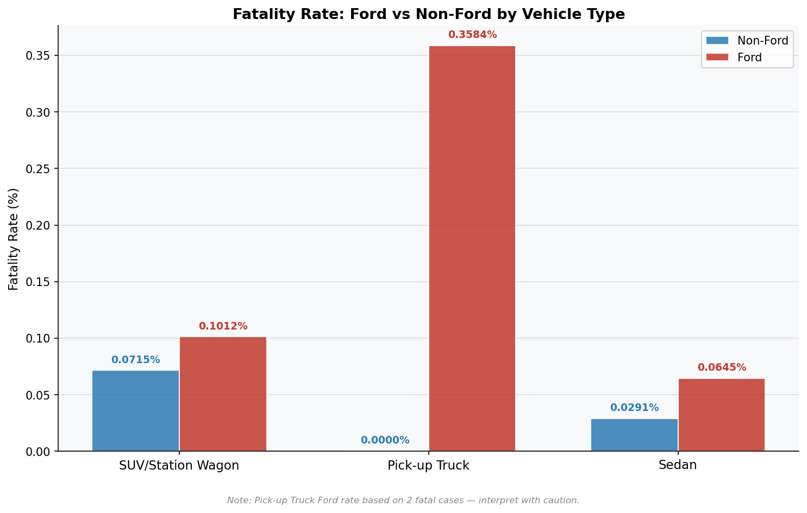
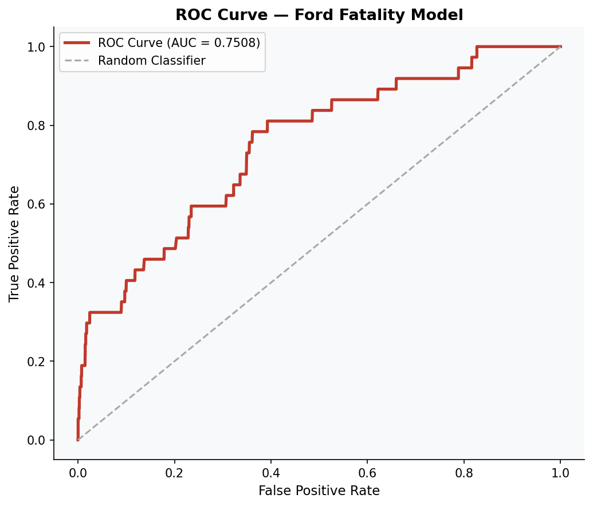

# NYC Fatal Crash Risk Analysis — Ford vs Non-Ford

## Overview
Logistic regression analysis on **65,096 NYC crash records** to quantify whether Ford vehicles are statistically associated with higher fatal crash outcomes, after controlling for vehicle type, driver demographics, licensing status, and situational factors.

This project demonstrates end-to-end statistical inference: from data cleaning and feature engineering to model evaluation, sub-sample analysis, and business recommendations.

---

## Key Findings

| Finding | Result |
|---|---|
| Main Ford effect | β = 0.869, **p = 0.046** (statistically significant) |
| Odds Ratio | OR ≈ 2.38 — Ford vehicles have ~2.4× higher odds of fatal crash |
| Female drivers | β = 1.604, **p = 0.044** — effect concentrated among female drivers |
| Newer vehicles | β = 1.053, p = 0.072 — borderline significant among vehicles 0–5 years old |
| Model ROC-AUC | 0.7508 — fair discriminative ability given extreme class imbalance |

---

## Technical Highlights

- **Feature Engineering** — 15+ features: Ford indicator, vehicle age (crash year − manufacturing year), vehicle-type dummies, license status, time-of-day flags
- **Class Imbalance** — 37 fatal crashes out of 65,096 (0.057%); no rebalancing applied to preserve real-world distribution for valid coefficient interpretation
- **Model Evaluation** — ROC-AUC, optimal threshold selection via ROC curve, confusion matrix comparison at default vs optimal threshold
- **Sub-Sample Analysis** — 7 sensitivity models stratified by vehicle type, driver sex, and vehicle age to test for heterogeneous effects
- **Feature Importance** — Coefficient-based visualization of all 15 predictors
- **Business Recommendations** — 4 actionable safety recommendations for Ford management

---

## Visualizations

### Feature Coefficients


### Ford Effect Across Sub-Sample Models


### Fatality Rate by Vehicle Type


### Model Evaluation — ROC Curve


---

## Project Structure
nyc-crash-ford-fatality-analysis/
├── ford_fatality_analysis.ipynb   # Full analysis notebook
├── Ford_on_death_rate.py          # Analysis script
├── README.md
├── requirements.txt
└── outputs/                       # Generated visualizations
├── eda.png
├── roc_curve.png
├── feature_importance.png
├── ford_coef_subsamples.png
└── fatality_by_vehicle_type.png

---

## Notebook Structure

| Section | Content |
|---|---|
| 1. Data Loading & Cleaning | Feature engineering, cleaning steps, variable definitions |
| 2. Exploratory Analysis | Class distribution, Ford vs Non-Ford fatality rate by vehicle type |
| 3. Main Model | Logistic regression with 15 controls, full output |
| 4. Model Evaluation | ROC-AUC, ROC curve, optimal threshold, confusion matrix comparison |
| 5. Feature Importance | Coefficient-based variable importance chart |
| 6. Sub-Sample Analysis | 7 models by vehicle type, driver sex, vehicle age |
| 7. Key Findings & Recommendations | Summary of 3 findings + 4 business recommendations |

---

## Data Source

**NYC Open Data — Motor Vehicle Collisions (NYPD)**  
https://data.cityofnewyork.us/Public-Safety/Motor-Vehicle-Collisions-Crashes/h9gi-nx95

*Note: Raw data files are not included in this repository due to file size. Download directly from NYC Open Data.*

---

## Tools & Libraries

```python
pandas        # Data manipulation
numpy         # Numerical computing
statsmodels   # Logistic regression, statistical inference
scikit-learn  # ROC-AUC, confusion matrix, model evaluation
matplotlib    # Visualizations
```

---

## Limitations

1. **Severe class imbalance** — 37 fatal crashes limit statistical power
2. **Observational data** — Results reflect association, not causation
3. **NYC only** — Limited generalizability to other regions
4. **Omitted variables** — Speed, weather, BAC, seatbelt use not available
5. **Brand-level analysis** — Masks differences across Ford models (F-150, Mustang, etc.)

---

## Key Takeaway

> Ford vehicles show a statistically significant positive association with fatal crash outcomes (β = 0.869, p = 0.046). The effect is unexpectedly concentrated among **female drivers** (β = 1.604, p = 0.044) — challenging the initial hypothesis that risk would be higher among male drivers given Ford's performance-oriented marketing strategy.